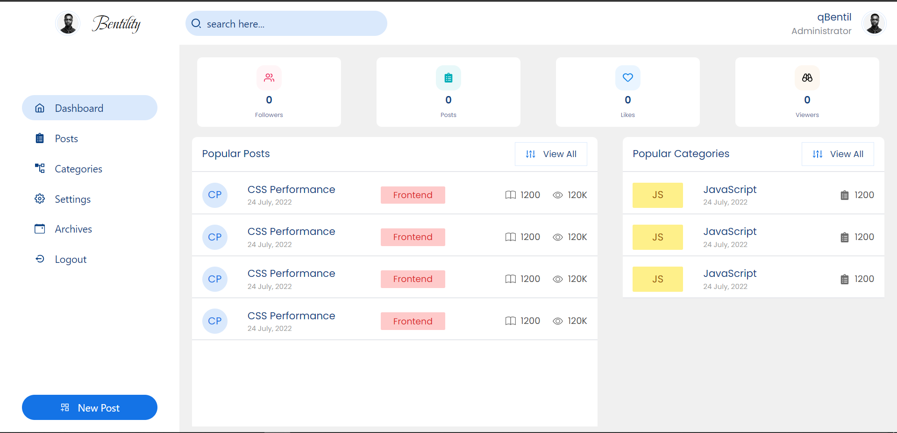

<div align="center" id="top"> 
  

  &#xa0;

  <a href="https://bentility.vercel.app">Demo</a>
</div>

<h1 align="center">Bentility Blog</h1>

<p align="center">
  

  

  

  

  

  

  
</p>

Status

<h4 align="center"> 
	🚧  Bentility 🚀 Under construction...  🚧
</h4> 

<hr>

<p align="center">
  <a href="#dart-about">About</a> &#xa0; | &#xa0; 
  <a href="#sparkles-features">Features</a> &#xa0; | &#xa0;
  <a href="#rocket-technologies">Technologies</a> &#xa0; | &#xa0;
  <a href="#white_check_mark-requirements">Requirements</a> &#xa0; | &#xa0;
  <a href="#checkered_flag-starting">Starting</a> &#xa0; | &#xa0;
  <a href="#memo-license">License</a> &#xa0; | &#xa0;
  <a href="https://github.com/qbentil" target="_blank">Author</a>
</p>

<br>

## :dart: About ##

Describe your project

## :sparkles: Features ##

:heavy_check_mark: Feature 1;\
:heavy_check_mark: Feature 2;\
:heavy_check_mark: Feature 3;

## :rocket: Technologies ##

The following tools were used in this project:

- [JavaScript](https://developer.mozilla.org/en-US/docs/Web/JavaScript)
- [Node.js](https://nodejs.org/en/)
- [Express](https://expressjs.com/)
- [MongoDB](https://www.mongodb.com/)
- [Mongoose](https://mongoosejs.com/)
- [JWT](https://jwt.io/)

## :white_check_mark: Requirements ##

Before starting :checkered_flag:, you need to have [Git](https://git-scm.com) and [Node](https://nodejs.org/en/) installed.

## :checkered_flag: Starting ##

```bash
# Clone this project
$ git clone https://github.com/qbentil/bentility

# Access
$ cd bentility

# Install dependencies
$ npm install

# Run the project
$ npm 

# The server will initialize in the <http://localhost:8800>
```

## :memo: License ##

This project is under license from MIT. For more details, see the [LICENSE](LICENSE.md) file.


Made with :heart: by <a href="https://github.com/qbentil" target="_blank">Shadrack Bentil</a>

&#xa0;

<a href="#top">Back to top</a>
